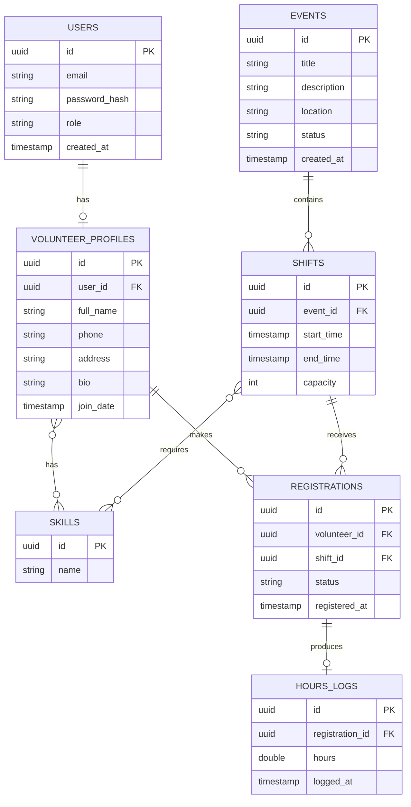

# Data Model

## Design notes

- **Partial unique index on `(volunteer_id, shift_id)` on `registrations`**
  (only over `REGISTERED`/`ATTENDED` rows) — prevents a volunteer from
  double-registering for the same *active* shift at the DB level, while
  still allowing them to cancel and later re-register for that same shift
  (a plain, non-partial unique constraint would permanently block that).
- **Capacity lives on `Shift`, not `Event`** — an event can have multiple
  shifts (e.g., a morning and afternoon slot) each with independent capacity.
- **`HoursLog` is 1:1 with `Registration`**, created only when a registration
  transitions to `ATTENDED` — hours are derived from the shift's actual
  start/end time, not manually entered, so they can't be fabricated.
- **`Skill` is a shared lookup table**, many-to-many with both volunteers
  (what they can do) and shifts (what's required) — lets you match/filter
  later without duplicating skill names as free text.
